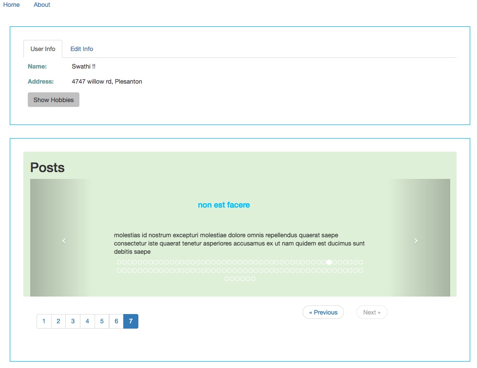

# How to start
npm install
ng serve --open
Go to http://localhost:4200/

#It has 2 features
## Contact Form
Create User form 
Edit User info 

## Get the posts
 Use service to get the posts
 Display posts
 
 ### ngx-bootstrap modules are included 

#sample screen
